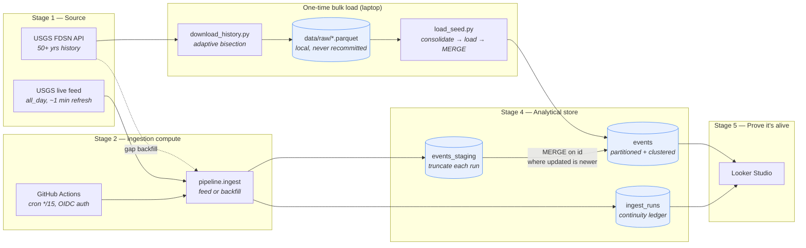

# USGS Earthquake Pipeline — CS 452 reference solution

A worked example of the [Build a Pipeline](../pipeline/build_a_pipeline.md) assignment,
schema-consistent tier. Bulk-loads ~50 years of the USGS earthquake catalog, then keeps
itself current every 15 minutes with nobody pushing the button.

**Stack:** USGS FDSN + live GeoJSON feed → GitHub Actions (cron) → BigQuery → Looker Studio

---

## Architecture



Stage 3 (buffer/streaming) is **deliberately skipped** — see [Choices](#choices-and-why) below.

---

## Measured results

Not estimates — these are what the build actually produced.

| | |
|---|---|
| Historical seed | **4,843,083 events**, 1970-01-01 → 2026-09-10 |
| Download | 37 min, 389 parquet chunks, 270 MB local, ~700 requests, 1 transient error (auto-recovered) |
| Bulk load | 10 consolidated files → BigQuery, MERGE of 4.8M rows in **14.1s** |
| In BigQuery | 1.118 GB across **681 monthly partitions** |
| Integrity | 4,843,083 rows / 4,843,083 distinct ids → **0 duplicates** |
| Idempotency | Re-ran ingest on an identical 263-event batch → **0 inserted, 0 updated** |
| Seed/trickle seam | seed ends `09-10 23:51`, feed picks up `09-11 00:00` — no gap, no overlap |
| Cost | **$0.00** |

The seam is the part worth looking at. The gap-bridging run fetched 264 events from the
live feed; 120 were already in the seed and 144 were new. The MERGE sorted that out
without being told where the boundary was.

---

## What's here

| Path | What it does |
|---|---|
| [`pipeline/usgs.py`](pipeline/usgs.py) | Fetch + normalize. Shared by seed and ingest so both produce identical rows. |
| [`pipeline/ingest.py`](pipeline/ingest.py) | The recurring job. Decides feed-vs-backfill, stages, merges, audits. |
| [`pipeline/bq.py`](pipeline/bq.py) | BigQuery: schema bootstrap, staging load, the idempotent MERGE. |
| [`seed/download_history.py`](seed/download_history.py) | One-time history download to local parquet. Resumable. |
| [`seed/load_seed.py`](seed/load_seed.py) | Bulk load from disk. Consolidates, loads, dedupes, merges. |
| [`sql/`](sql/) | Schema DDL + the liveness, continuity, idempotency and history-join queries. |
| [`pipeline/healthcheck.py`](pipeline/healthcheck.py) | Fails loudly when data goes stale — catches "green but writing nothing." |
| [`.github/workflows/ingest.yml`](.github/workflows/ingest.yml) | The cron. |
| [`.github/workflows/healthcheck.yml`](.github/workflows/healthcheck.yml) | The watchdog, every 6 hours. |
| [`docs/runbook.md`](docs/runbook.md) | Failure modes and what to do about them. |

---

## Choices, and why

### Stage 1 — USGS Earthquakes

Picked for three properties the other sources don't combine as well:

- **Liveness is provable in minutes.** The feed refreshes about every minute, so a
  15-minute cadence produces a visibly growing chart the same afternoon. EIA data
  arrives hours late; Open-Meteo's archive trails by days. Both make a compelling
  "it's alive" demo much harder.
- **Idempotency is genuinely required, not performative.** USGS *revises* events.
  A magnitude gets corrected after human review, and `status` flips `automatic` →
  `reviewed`. The very first row of our seed — a quake on 2026-01-01 — carries an
  `updated` timestamp of **2026-05-14**, four and a half months later. So dedup-on-id
  alone is *wrong*: it would pin the machine's first guess forever and quietly serve
  stale magnitudes. You need MERGE-on-newer-revision.
- **No API key**, so the free service stays free without a signup funnel.

### Stage 2 — GitHub Actions cron, every 15 minutes

The wildcard option, chosen over Cloud Scheduler + Cloud Run on purpose:

- **It runs when the laptop is closed.** For an assignment explicitly graded on still
  being alive a week later, that is the whole ballgame.
- **The schedule is version-controlled.** The cadence lives in a reviewable file, not
  in console state somebody has to remember to screenshot.
- **Free, and no credit card.** Public repos get unlimited minutes; private repos get
  2,000/month, and ~96 runs/day × ~30s is roughly 50 minutes/day. Comfortable.

Cost: GitHub's scheduler is best-effort. A `*/15` cron does not fire exactly on the
quarter hour, and under load it can slip 10+ minutes. The design absorbs that rather
than fighting it (see the overlap window below).

**Why the seed uses different compute.** The bulk load runs on a laptop, moves millions
of rows, and takes minutes. The recurring job runs on a hosted runner, moves hundreds of
rows, and takes seconds. Sizing them the same would be wrong in both directions — a
GitHub runner has a 6-hour ceiling and no local disk worth using, and spinning up
serverless infrastructure to do something once is pure ceremony.

### Stage 3 — no buffer

Skipped, and this is a real decision rather than a shortcut. A Pub/Sub topic between
ingest and BigQuery would decouple the two, but at ~300 events per run there is nothing
to decouple: the write takes under a second and BigQuery's own load jobs already provide
the durability a buffer would add. A buffer earns its place when producers and consumers
scale independently, when the consumer can fall behind, or when several consumers need
the same stream. None of those are true here.

**When it would flip:** a push-based source (Wikimedia's SSE firehose) has no window to
re-read, so an always-on consumer plus a buffer stops being optional. The distinguishing
question is not volume — it's whether the source *lets you ask again for the same data*.
USGS does, so the overlap window is our buffer.

### Stage 4 — BigQuery

`events` is `PARTITION BY TIMESTAMP_TRUNC(event_time, MONTH)` and `CLUSTER BY id`:

- **Partitioning** because every analytical query filters on event time, and — more
  importantly — the MERGE can prune to the one or two partitions the batch touches
  instead of rewriting a 4.8M-row table 96 times a day.
- **Clustering on `id`** because the hot path is a point-lookup MERGE on exactly that
  column. High-cardinality string, looked up constantly: the textbook clustering case.

> **Monthly, not daily — and we found out the hard way.** The first version partitioned
> by `DATE(event_time)`, which is the obvious choice and is wrong here. The seed spans
> 1970 to now: ~20,700 days. The seed MERGE failed with
> `Too many partitions produced by query, allowed 4000, query produces at least 4001`,
> and 20,700 daily partitions would also have blown past BigQuery's 10,000-per-table
> limit. Monthly gives ~680 partitions for the same 57 years.
>
> Pruning barely suffers: the live job's 24-hour window still touches one or two
> partitions, and a recent monthly partition is only ~18k rows. **The general rule:
> partition granularity is set by your data's total time span, not just by your query
> pattern.** Daily partitioning is right for two years of data and impossible for fifty.
>
> One corollary in the code: the MERGE predicate filters on `event_time` directly, not
> `DATE(event_time)`. Wrapping a partition column in a function hides it from the pruner
> and quietly scans the whole table — the query still returns the right answer, so
> nothing fails and you just pay for it forever.

### Stage 5 — Looker Studio

Free, native BigQuery connector, shareable link. Setup in [`docs/dashboard.md`](docs/dashboard.md).

---

## Requirements

### 1. Idempotency

The job re-reads the same 24-hour window every 15 minutes, so each event is fetched
roughly **96 times**. Three layers keep that from duplicating anything:

1. **In-batch dedup** ([`usgs.dedupe`](pipeline/usgs.py)) keeps the newest revision per
   id *within* a batch. Not optional: BigQuery's MERGE throws outright if two source
   rows match the same target row.
2. **MERGE on `id`, gated on `S.updated > T.updated`**
   ([`bq.merge_staging_into_events`](pipeline/bq.py)). Re-ingesting an unchanged event
   is a no-op, so the overlap costs nothing. A newer revision replaces the row.
3. **Seed load also merges** rather than inserts, so bulk load and trickle can run in
   either order — or twice — and converge.

Verify with [`sql/idempotency_check.sql`](sql/idempotency_check.sql): `total_rows` must
equal `distinct_ids`.

> **The subtle one.** The MERGE's partition-pruning predicate lives in the `ON` clause,
> and a predicate there that wrongly excludes an existing row does not merely skip the
> update — the row falls through to `NOT MATCHED` and gets **inserted as a duplicate**.
> BigQuery enforces no primary key, so nothing would catch it. A relocated event's origin
> time can shift by a second or two, which is enough to cross midnight into an unscanned
> partition. The window is padded by a day on each side: two extra partitions out of
> ~20,000, and the failure mode is gone.

### 2. Gaps and failure handling

**The seed/trickle gap.** The seed stops at midnight of the day it ran; the live feed
only covers the last 24 hours. The gap between them is closed automatically:
[`decide_mode`](pipeline/ingest.py) compares the newest event held against now, and if
it exceeds 20 hours the run escalates from the feed to an **FDSN range query** covering
the hole. No manual bridging step, and the same code path repairs a long outage.

**Why a 24-hour overlap window.** The job polls `all_day`, not `all_hour`. Every run
re-reads a full day of events. That means any run can miss — GitHub queue delay, USGS
500, expired token, runner outage — and the *next* successful run silently repairs it.
Self-healing for outages up to a day, at a cost of a few hundred redundant rows that the
MERGE discards anyway. Longer than a day, and the backfill path takes over.

**When the API is down at 3 a.m.:** the run **fails loudly and skips** rather than
retrying forever. `usgs._get` retries 5 times with exponential backoff for transient
blips; past that the run records `status='error'` in `ingest_runs`, exits non-zero, and
GitHub emails a failure notice. It does *not* try to backfill in place — recovery is the
next run's job, and that run has a full day of overlap to work with. Failing fast and
recovering on schedule beats a job that hangs holding the concurrency lock.

A real example the build hit: USGS answers an unbounded `/count` over the whole catalog
with `503 ... SQLSTATE[HY000]: General error: 1114 The table '/rdsdbdata/tmp/#sql...' is
full`. Their backend cannot scan the full catalog. That is why the seed **bisects time
ranges** rather than asking for everything and paginating.

**Quiet runs are not failures.** A run that fetches nothing still writes an
`ingest_runs` row with `status='no_new_data'`. Without that ledger, a quiet hour and a
dead pipeline are indistinguishable after the fact — both are just an absence of rows in
`events`. This is the table that answers "prove there were no gaps."

Full list of known failure modes in [`docs/runbook.md`](docs/runbook.md).

### 3. Secrets management

**There is no secret in this repo, and no long-lived credential anywhere.**

Authentication uses **Workload Identity Federation**. The Actions runner proves its
identity with a short-lived OIDC token; Google exchanges that for a ~1-hour access
token. Trust is scoped by attribute condition to this one repository, so a fork or
another repo in the org cannot mint a token. Nothing to rotate, nothing to leak, nothing
to accidentally commit.

The alternative — a service-account JSON key in `secrets.GCP_SA_KEY` — is what most
solutions use and is acceptable, but it is a permanent credential sitting in a settings
page, and the assignment's warning that a private repo "will one day not be" applies to
it exactly. Details and the fallback setup: [`docs/secrets.md`](docs/secrets.md).

Non-sensitive config (project id, dataset name, the WIF provider path) lives in
**repository variables**, not secrets — they aren't secret, and pretending otherwise
teaches the wrong reflex.

### 4. Cost accounting

**Actual spend: $0.00.** Detailed breakdown in [`docs/cost.md`](docs/cost.md).

| Resource | Usage | Cost |
|---|---|---|
| GitHub Actions | ~96 runs/day × ~30s ≈ 50 min/day | $0 — unlimited on public repos, under the 2,000 min/month private allowance |
| BigQuery storage | ~1.2 GB | $0 — first 10 GB/month free |
| BigQuery queries | ~2 GB/month (partition pruning does the work) | $0 — first 1 TB/month free |
| USGS API | free public service, no key | $0 |

The project has billing enabled, so this is free-tier headroom rather than a hard
sandbox cap — worth knowing, because the failure mode differs. A sandbox refuses the
query; a billed project runs it and charges you. The guard here is partition pruning:
without it, 96 daily full scans of a 1.2 GB table would still land inside the free tier,
but the same mistake on a 5 TB table would be a $600 surprise. Build the habit at the
size where it's free.

---

## Running it

```bash
python -m venv .venv && ./.venv/Scripts/activate   # Windows; use bin/activate elsewhere
pip install -r requirements.txt
gcloud auth application-default login

python -m pipeline.bootstrap                       # create dataset + tables
python -m seed.download_history --start-year 1970  # ~37 min, ONCE, writes to data/raw/
python -m seed.load_seed                           # bulk load from disk
python -m pipeline.ingest --dry-run                # check without writing
python -m pytest tests/ -q
```

> **Seeding etiquette.** `download_history.py` writes to `data/raw/` and `--resume`
> skips anything already on disk. Run it once. `data/` is gitignored and
> `load_seed.py` never touches the network. USGS is a free public service; a class
> re-downloading 50 years of history on every iteration is how it stops being free —
> and reading your own parquet is 100× faster anyway.

---

## Honest limitations

- **GitHub disables scheduled workflows after 60 days of repo inactivity.** Fine for a
  one-week assignment, fatal for a semester. A dated commit or a keepalive workflow fixes
  it; here it's documented rather than solved, because knowing the expiry exists is the
  lesson.
- **The watchdog shares fate with what it watches.**
  [`healthcheck.yml`](.github/workflows/healthcheck.yml) runs every 6 hours and fails if
  nothing has been written in 90 minutes — which catches the nastiest failure, a job
  that runs green while writing nothing. But it runs on the same GitHub Actions
  scheduler as the ingest job. If Actions stops running workflows for this repo, both
  die together and nothing alerts. A monitor that can't outlive the thing it monitors
  isn't really a monitor; genuinely independent checking means a different provider.
- **`ingest_runs` grows forever** at 96 rows/day. Irrelevant at this scale, wrong at a
  larger one; a partition expiry policy is the fix.
- **The seed starts at 1970.** Pre-1970 coverage is sparse and instrumentally
  inconsistent. That's a defensible cut, but it *is* a cut, and the "detection improves
  over time" query in `today_vs_history.sql` shows why comparing raw counts across
  decades is a trap regardless.
